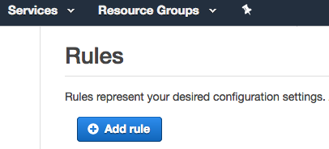
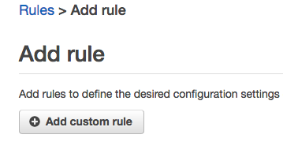
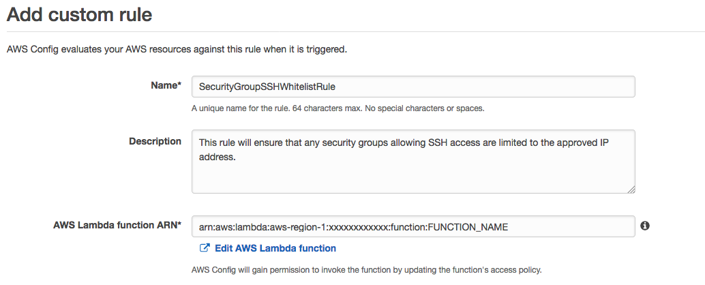
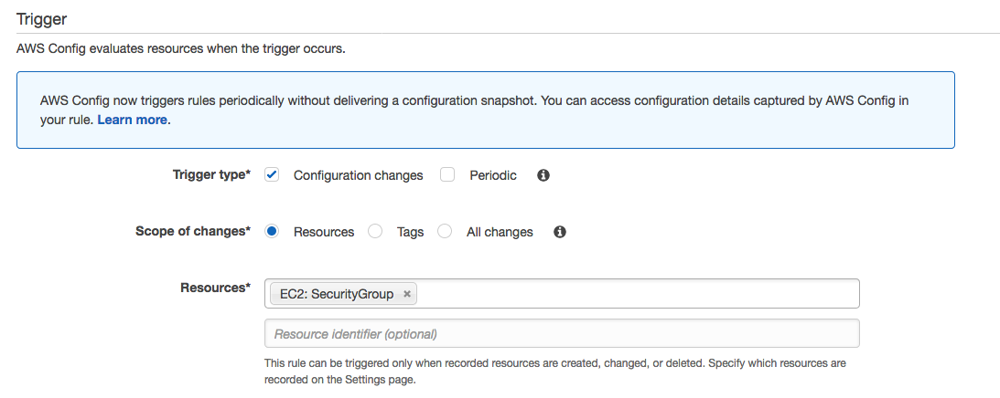
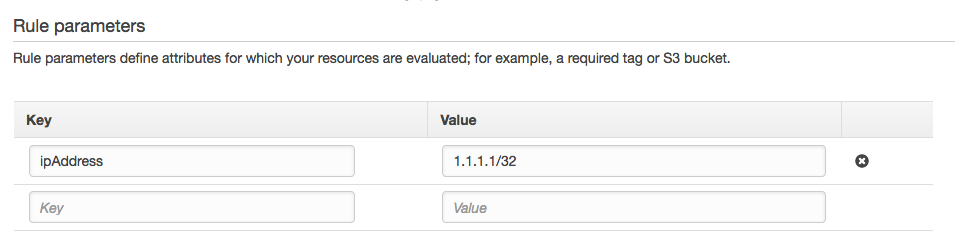
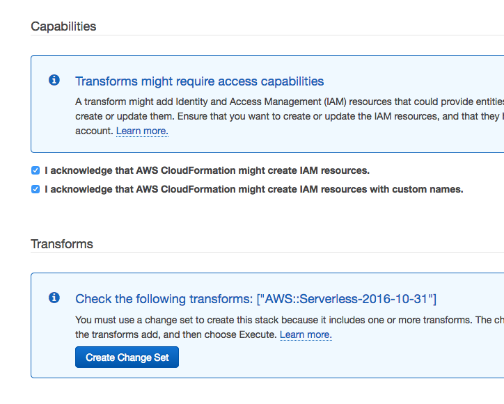

# Creating your first custom rule with AWS Config
For module one of this workshop, we will walk you through creating a custom rule in AWS Config, with all of the code already written for you.  Then, we will show you how to get credit for creating this rule to earn points on the Config Rules Workshop Leaderboard.  The subsequent modules will have far less instruction, and it will be up to you to learn from this first Config Rule to complete the remaining rules!

## The Purpose of This Rule
This rule is intended to ensure that all SSH access granted via security groups is entirely locked down to a single /32 IP address (1.1.1.1/32 for this hypothetical exercise).  An organization may want to have a rule similar to this to ensure that all SSH traffic is originating from a bastion host or gateway device within their known and controlled network.  Any security groups that allow SSH access to an IP address or IP range other than 1.1.1.1/32 should be evaluated as Noncompliant.

## Create a Lambda Function
Each Config rule that you create and manage is an AWS Lambda function that contains the logic for evaluating resource configurations tracked and notified through AWS Config. All of the code that we have provided for this module (in [`rule.py`](./rule.py)) represents a complete Lambda function to evaluate security group configurations according to the rule we have described above, in Python 3.6. In order to create a Lambda function for this code to be executed, follow these steps:

1. Visit the [AWS Lambda console](https://eu-west-1.console.aws.amazon.com/lambda/home?region=eu-west-1).

2. Select **Create Function**

3. Select **Author from Scratch**

4. For **Name** choose any descriptive name for this function, like *ConfigRules-CheckSecurityGroup*, or similar. For **Role** select, *Create new role from template(s)*. For **Role Name**, choose any descriptive name for this role, like *ConfigRules-CheckSecurityGroup-Role*.  For **Policy templates** choose, *AWS Config Rules permissions*.  This will grant the role the basic permissions that all Lambda functions require (to create and send logs to CloudWatch Logs), and permissions to notify AWS Config of new compliance evaluation results.

5. Choose **Create Function**

6. Within the Lambda function Code Editor, modify the **Runtime** to be *Python 3.6*. The remainder of the configuration can remain as default.

7.  Copy all of the code within [**rule.py**](./rule.py) and paste it in the Code Editor within the Lambda console, replacing all the previous contents.

8. Click **Save and Test**

9. You will be prompted to create a test event that will be used to invoke your Lambda function, to test it's logic.  Copy the contents of [**compliant_test_event.json**](./compliant_test_event.json) or [**noncompliant_test_event.json**](./noncompliant_test_event.json) and paste it within the Test Event editor, replacing any of the Event Templates chosen. Name your event something descriptive, and **Create**.

10.  Your Lambda function will execute, and return a response of either COMPLIANT or NONCOMPLIANT. If your rule returns the appropriate response to both dryrun events, things are working as expected!

Next we will enable AWS Config and create your first Config Rule so that this Lambda function is executed whenever configuration changes occur for your security groups.

## Enabling AWS Config
If you have never used the AWS Config Service, you will first need to enable it.  Follow [these steps to enable AWS Config](http://docs.aws.amazon.com/config/latest/developerguide/gs-console.html), be sure you enable config within the appropriate region for this workshop: [eu-west-1/Ireland](https://eu-west-1.console.aws.amazon.com/config/home?region=eu-west-1).

## Creating a Config Rule
1. On the AWS Config console home page, choose **Rules**, then **+Add Rule**:

2. Here, you'll see many available Config Rules that AWS has created and will manage for you, called Managed  Rules. For this workshop we will be creating Custom Rules.  Choose **+Custom Rule**:

3. Name your Config Rule something descriptive like, *SecurityGroupSSHWhitelistRule*, and give it a description.  For **Lambda Function ARN**, copy the ARN that is visible within the Lambda console for the Lambda function you created above, and paste the full ARN here. It should have the form of *arn:aws:lambda:aws-region-1:xxxxxxxxxxxx:function:FUNCTION_NAME*:

4. Next, you have the option of either having this rule be evaluated as changes occur to AWS resources (*Configuration changes*) or on a schedule (*Periodic*).  For this workshop, all of the rules with be triggered by **Configuration changes**, so choose that option.  For configuration change triggered rules, you have the ability to scope event triggers to either resources of a particular type change (*Resources*), when any resources that share a specified tag change (*Tags*) or when AWS Config records the change of any resource (*Any*). For this workshop, our scope will be **Resources**.
5. You then will select for which type of AWS resources should the configuration changes be sent to your Config rule for evaluation. This first module's rule evaluates Security Groups. So select **Security Groups**.  When writing your own rules in the future, you may not care to have your Config rule evaluate every single resource of a particular type. AWS Config allows you to specify a Resource identifier if you'd like the rule to only execute for that single resource, and not all others of the same type.  For this workshop, leave *Resource identifier* blank:

6. AWS Config has the ability to pass configuration parameters to your Lambda function along with each invocation event.  They will arrive as key:value pairs within the event object as part of the *RuleParameters* attribute. For this first example rule, our Lambda function makes use of one parameter - **ipAddress**. This represents the single /32 IP address that as treated as the allowed IP address for SSH traffic to security groups in your account. So create one Rule parameter with the key **ipAddress** and a value of **1.1.1.1/32**. Keep in mind that the key name is case-sensitive:

7. Choose **Save**

8. Next, you will see your new Config Rule listed on the Config Rules dashboard.  Here you'll see a summary view of all existing Config rules within your account. Click on your rule, and you are taken to the dashboard for your new Config Rule, where you're able to edit it later, view the compliance status for each of the applicable resources, and more.  If your Lambda function was created successfully, you will be able to begin seeing any security groups that you have existing within this region appear and declared either Compliant or Noncompliant.

## Scoring!
After you have tested your Config Rule to your satisfaction for each module, you will find a button located within each Module directory, to launch a CloudFormation stack.  This stack will create all of the resources required to test and assess the correctness of the Config Rule and Lambda function you've created.  Each assessment occurs as an **Execution** via an AWS Step Functions State Machine that is created by the CloudFormation template for that module.  

1. Click the button below to launch the template, leaving all settings as default (checking boxes on the **Review** page to acknowledge the stack will create IAM resources, and choosing the **Create Change Set** button so that the Serverless Application Model template will be transformed into a CloudFormation template):

Region| Launch
------|-----
EU (Ireland) | 

2. After the stack has been created, visit the Step Functions console in the region you have created the stack, select the created state machine for the module, and then choose **New Execution**:

3. For the Execution Input, visit the [**Config Workshop Leaderboard**](https://amzn.to/aws-config-rules-workshop), and after you have Created or Joined a team, choose the **Copy JWT** button:

4. Take what you've just copied and paste it to replace the default State Machine input for the state machine created for this Module:  

5. Then choose **Start Execution**.

6. The execution will take 5-10 minutes to complete, and it's path through the state machine will indicate if your Config Rule has met the requirements and if any points have been scored for your team!  

### Earn Points Together
You can only get credit for the same rule once, as an individual team member.  But your team *will* receive points for the same rule as different team members complete each Module - **so help your team members complete their rules as well!**
